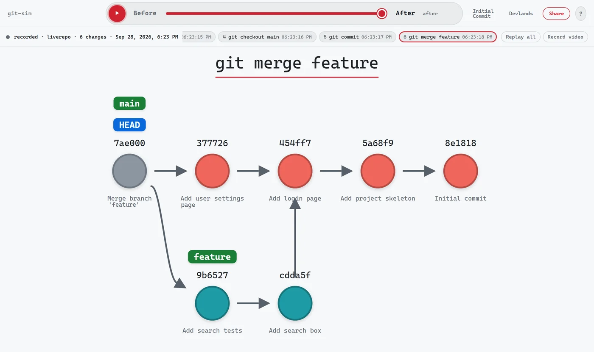
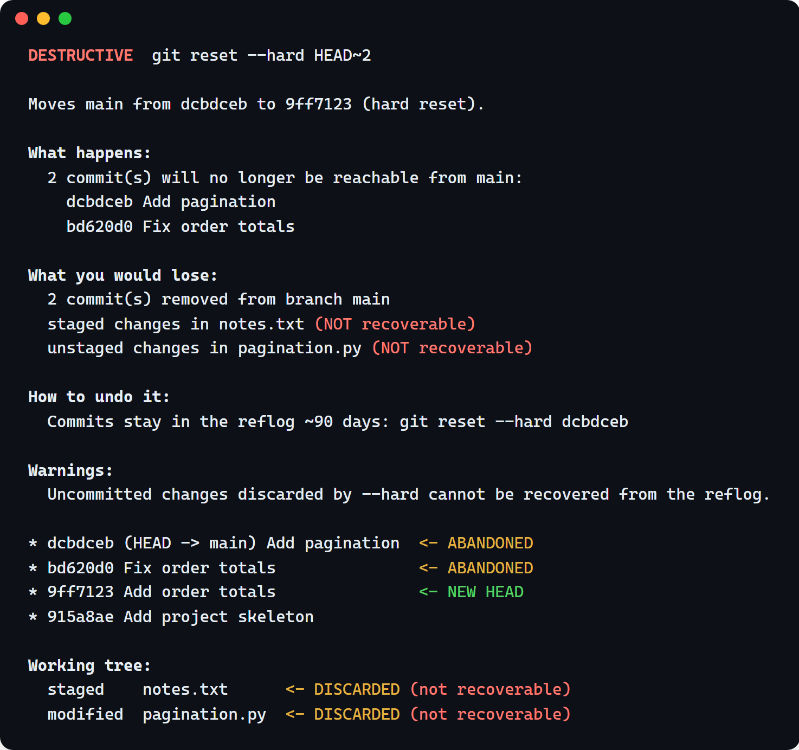
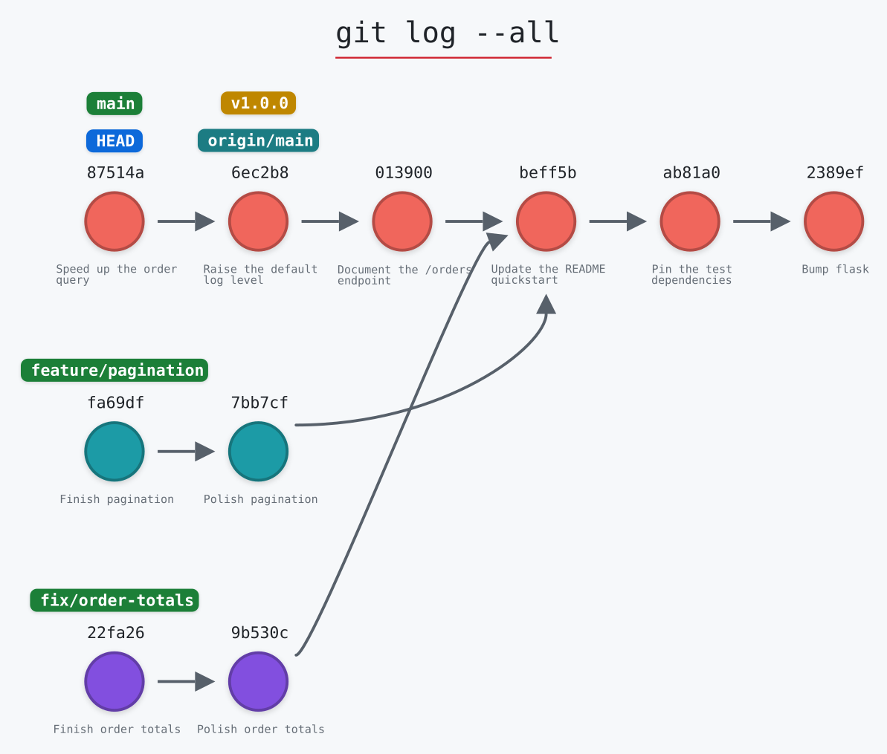
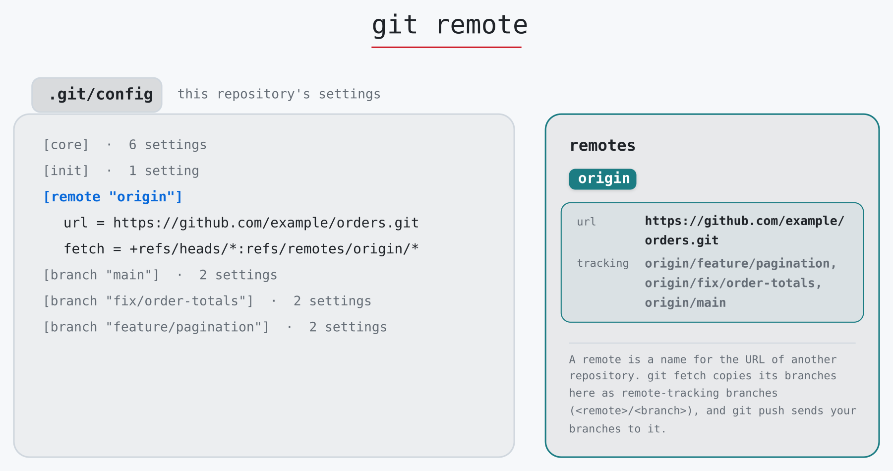
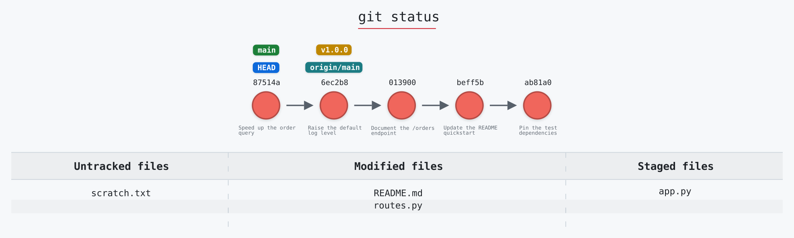

# git-sim


<a href="https://initialcommit.com/tools/git-sim"></a> [](https://github.com/initialcommit-com/git-sim/blob/main/LICENSE) [](https://img.shields.io/github/v/release/initialcommit-com/git-sim) [](https://pepy.tech/project/git-sim) [](https://github.com/initialcommit-com/git-sim/graphs/contributors)

**The visual layer for Git in your own repos:** simulate, record, replay, audit, and share individual Git commands or entire Git workflows, wherever you or your agents run them.

- **Simulate any Git command before it runs**, as an interactive graph you can step through. In the terminal, on the web, and in VS Code, Jupyter, Vim / Neovim / Emacs, and GitHub pull requests.
- **Track your repo live** while recording every Git operation, human or agentic, as a visual command sequence you can replay. On the web and in VS Code.
- **Catch and review risky Git commands from AI agents** in real time, before they harm your work. Claude Code, GitHub Copilot, Cursor, Codex, Gemini CLI, and any MCP agent.
- **Share any git-sim output** as a link, an embed, an HTML page, a PNG or SVG image, an MP4 video, or a social post.

All graphs that appear in this readme were generated by git-sim. Click any graph to open it in the [git-sim viewer](https://initialcommit.com/tools/git-sim/viewer).

<table><tr>
<td width="50%"><a href="https://initialcommit.com/tools/git-sim/viewer?demo=pull"></a><br/><code>$ git-sim pull origin main</code></td>
<td width="50%"><a href="https://initialcommit.com/tools/git-sim/viewer?demo=merge"></a><br/><code>$ git-sim merge feature/pagination</code></td>
</tr><tr>
<td width="50%"><a href="https://initialcommit.com/tools/git-sim/viewer?demo=rebase"></a><br/><code>$ git-sim rebase feature/pagination</code></td>
<td width="50%"><a href="https://initialcommit.com/tools/git-sim/viewer?demo=cherry-pick"></a><br/><code>$ git-sim cherry-pick fix/order-totals</code></td>
</tr></table>

## Requirements

- Python 3.10 or later, and Git
- Minimal Linux images also need the `libGL` and `fontconfig` system libraries
- Animated video (`--animate`) also needs Manim: see [Installation](#installation)

## Get started

**1. Install git-sim**

```console
$ pip install git-sim
```

Or `pipx install git-sim`, or `uv tool install git-sim`.

**2. Simulate a command:** in a local Git repo, prefix any Git command with `git-sim` instead of `git`

```console
$ git-sim merge dev
$ git-sim reset --hard HEAD^
$ git-sim rebase main
```

git-sim creates visual dry-runs. It generates an interactive graph of exactly how any Git command will impact your repo, without actually running the real Git command so nothing changes in your repo.

Run `git-sim -h` to list every command.

**3. Watch your repo live:** a graph that follows your repo as it changes, and records every command you (or your agents) run

```console
$ git-sim live
```

**4. Install the git-sim VS Code extension**

```console
$ code --install-extension initialcommit.git-sim
```

Or search for **git-sim** in the Extensions view (the Marketplace in VS Code, Open VSX in Cursor, Windsurf, and VSCodium).

**5. Vim, Neovim, and Emacs integration**

For Vim, Neovim, and Emacs, see [integrations/](integrations/).

**6. Jupyter integration**

For Jupyter, `gh`, and GitHub Actions, see [docs/integrations.md](docs/integrations.md).

**7. Check a risky command before it runs:** how risky it is, and what you could lose

```console
$ git-sim preflight reset --hard HEAD~1
```

**8. Connect your AI agents:** add the pre-flight hook and MCP server to the agents on your machine

```console
$ git-sim wire-agents
```

No Git repo handy to visualize? The bundled [git-dummy](https://github.com/initialcommit-com/git-dummy) creates Git repos in whatever structure you want to play with:

`git-dummy --scenario orders` builds the sample repo the graphs in this README are drawn on (`--scenario orders-behind` for fetch and pull), so you can run the same commands in it.

## Your Git repo data stays on your machine

The interactive page opens in the git-sim viewer at initialcommit.com, but the graph travels compressed in the link's `#fragment`, which browsers never send to a server, so nothing about your code reaches the site.

For example, `git-sim branch feature` opens a link like this one, shortened here (the full link is about 2,000 characters):

```text
https://initialcommit.com/tools/git-sim/viewer#d=eNrNWdtu2zgQ_RVBxaK7QEzzTqmIDbjJusWifdkC-06LlK1GlgxJiZP9-h3q4lvcpqqdrf1gmJSGnDOXw-H4unyYe4kZ-...&t=git+branch+feature&m=light&p=git-sim-branch_10-04-26_19-02-11.html
```

Everything after the `#` stays in your browser: `d` is the compressed graph, `t` the command, `m` the color theme, and `p` the name of the copy saved on your machine. All the site receives is `https://initialcommit.com/tools/git-sim/viewer`.

The page is also saved locally, and `--open-in local` (or `git_sim_open_in=local`) opens that file instead, offline.

## Live mode

```console
$ git-sim live
```

[](docs/live.md)

Live mode follows your repo as it changes and plays each change on the graph the moment it happens, whoever made it: you in a terminal, your editor's Git buttons, or an AI agent. It names the command that ran (`git commit`, `git rebase`, `git stash`, and so on) and keeps every change in a strip above the graph, so you can step back to any of them, replay the whole session, save it as a single HTML page, or record it as a video.

The page opens in the git-sim viewer, and the graphs come from a small server git-sim runs on your machine, reachable only from `127.0.0.1` and with a session key. Its address travels in the link's `#fragment`, so nothing about your repo reaches the site, and `--open-in local` serves the page from git-sim itself instead.

Useful options: `-C <path>` for another repo, `--no-zones` for the commit graph alone, `--interval <seconds>` to check more or less often, and `--replay` to reopen the last session. See [docs/live.md](docs/live.md) for the rest.

## Pre-flight

```console
$ git-sim preflight reset --hard HEAD~2
```

[](docs/mcp.md)

Pre-flight shows what a command that can lose work would do before you run it, worked out from your repo rather than guessed: how risky it is, which commits would become unreachable, which changes would be lost for good, and the command that undoes it, all without touching your repo.

AI agents get the same check: the [pre-flight hook and MCP server](docs/mcp.md) run it before an agent executes a destructive Git command, so the agent stops and asks you first (`git-sim wire-agents` sets this up). `--markdown` formats the report for a pull request comment, which the [GitHub Action](docs/integrations.md) uses, and the [VS Code extension](docs/vscode.md) shows it in an editor tab.

## Supported Git commands

Command syntax follows Git's own. Click a command for its usage and options, and a graph to open it in the viewer and drag its slider:

<details>
<summary><b><code>git add</code></b>: stage files, folders, or everything</summary>

Usage: `git-sim add <pathspec>...` | `git-sim add -A`

- Specify one or more files or folders, relative to where you run it, as git reads them: a folder stages every change inside it, and `git-sim add .` stages everything under the current folder
- `-A`/`--all` stages every change in the repository (modified, deleted and untracked files), wherever it's run from
- Simulated output will show files being moved to the staging area
- Note that simulated output will also show the most recent 5 commits on the active branch

[](https://initialcommit.com/tools/git-sim/viewer?demo=add)

</details>
<details>
<summary><b><code>git bisect</code></b>: find the commit that introduced a bug</summary>

Usage: `git-sim bisect start [<bad> [<good>...]]` | `git-sim bisect good|bad|old|new|skip [<commit>]` | `git-sim bisect reset [<commit>]`

- `start <bad> <good>` draws the `bad` and `good-<sha>` marks, turns the commits still suspected purple, and moves `HEAD` to the commit git checks out to test next
- The next commit comes from git itself (`git rev-list --bisect`, and git's own rule when commits were skipped), so the drawing matches what `git bisect` does
- `good`, `bad` and `skip` continue the session in progress (read from `refs/bisect/*`), marking `HEAD` or the given commit; once one suspect is left it is drawn in gold as the first bad commit
- `reset` removes the marks and returns `HEAD` to where the session started

</details>
<details>
<summary><b><code>git blame</code></b>: who last changed each line, and in which commit</summary>

Usage: `git-sim blame <file> [-L <start>,<end>]`

- A code view of the file: each line has a colored gutter for the commit that last changed it, with that commit's short hash at the start of each run of lines
- Each of those commits is painted the same color in the graph; lines edited but not committed yet are grey
- `-L` limits it to a range of lines, as in git (`10,20` or `10,+5`)

</details>
<details>
<summary><b><code>git branch</code></b>: create, delete, rename, list, and track branches</summary>

Usage: `git-sim branch <new branch name> [<start-point>]` | `git-sim branch -d|-D <branch>` | `git-sim branch -m <branch> <new name>` | `git-sim branch [-a] [-v|-vv] [--merged|--no-merged [<commit>]]` | `git-sim branch -u <upstream> [<branch>]`

- Specify `<new branch name>` as the name of the new branch to simulate creation of
- Simulated output will show the newly created branch ref along with the most recent 5 commits on the active branch
- `-d` deletes a branch that is merged into the active branch; git-sim refuses (like git) if it is not
- `-D` force-deletes: commits that only the deleted branch reached are drawn in gold, with the `git branch <name> <sha>` command that brings them back
- `-m` renames a branch, moving its label in place
- Without a name, lists the branches: the graph with every branch drawn, and a card listing them with the current one marked. `-a`/`--all` adds the remote-tracking branches, `-v` each branch's last commit, `-vv` also its upstream and how far ahead or behind it is
- `--merged [<commit>]` and `--no-merged [<commit>]` (default `HEAD`) highlight the branches git would list: those whose tips are, or aren't, in the commit's history
- `-u <upstream>`/`--set-upstream-to=<upstream>` shows the `[branch "x"]` lines it writes to `.git/config`, and the branch's new `[upstream: ahead n, behind m]` on its label

[](https://initialcommit.com/tools/git-sim/viewer?demo=branch-d)

</details>
<details>
<summary><b><code>git check-ignore</code></b>: which ignore rule decides a path</summary>

Usage: `git-sim check-ignore [-v] <path>...`

- Shows the ignore file with numbered lines and highlights the rule that decides each path; a rule from .git/info/exclude, a nested .gitignore or your core.excludesFile gets a card of its own
- Beside it, each path's verdict: ignored by which line, un-ignored by a `!` line, matched by nothing, or tracked, which no ignore rule can undo
- `-v` (`--verbose`) shows what `git check-ignore -v` prints: the source, line and pattern for each match

</details>
<details>
<summary><b><code>git checkout</code></b>: switch branches, or create one</summary>

Usage: `git-sim checkout [-b] <branch>`

- Checks out `<branch>` into the working directory, i.e. moves `HEAD` to the specified `<branch>`
- The `-b` flag creates a new branch with the specified name `<branch>` and checks it out, assuming it doesn't already exist

[](https://initialcommit.com/tools/git-sim/viewer?demo=checkout)

</details>
<details>
<summary><b><code>git cherry-pick</code></b>: copy commits onto the active branch</summary>

Usage: `git-sim cherry-pick <commit>|<A..B> [-n]` | `git-sim cherry-pick --continue|--abort|--skip`

- Specify `<commit>` as a ref (branch name/tag) or commit ID to cherry-pick onto the active branch
- A range `A..B` picks every commit reachable from `B` but not `A`, oldest first, as a chain of new commits
- `-n`/`--no-commit` applies the changes to the index and working tree without creating a commit
- Supports editing the cherry-picked commit message with: `$ git-sim cherry-pick <commit> -e "Edited commit message"`
- `--continue`, `--abort` and `--skip` act on a cherry-pick stopped on a conflict: git-sim runs the real command in a copy of the repository (yours is never touched) and draws what it would do: new commits fade in, HEAD and the branch move, commits left behind turn gold, and a new conflict is listed

[](https://initialcommit.com/tools/git-sim/viewer?demo=cherry-pick)

</details>
<details>
<summary><b><code>git clean</code></b>: delete untracked files</summary>

Usage: `git-sim clean [-f] [-n] [-d] [-x]`

- Simulated output will show untracked files being deleted, taken from git's own dry run (`git clean -n` with the same flags)
- `-d` includes untracked directories, `-x` includes ignored files (build output, virtualenvs)
- Without `-f` or `-n` the simulation notes that real git would refuse to run
- Note that simulated output will also show the most recent 5 commits on the active branch

[](https://initialcommit.com/tools/git-sim/viewer?demo=clean)

</details>
<details>
<summary><b><code>git clone</code></b>: copy a repository</summary>

Usage: `git-sim clone [--depth <n>] [-b <branch>] <url> [<path>]`

- Clone the remote repo from `<url>` (web URL or filesystem path) to a new folder in the current directory
- Output will report if clone operation is successful and show log of local clone
- `--depth <n>` makes a shallow clone: only the last `<n>` commits are drawn, and the oldest is marked `grafted`, cut off from parents that stay on the server
- `-b`/`--branch <branch>` checks out that branch (or tag) instead of the one the remote's HEAD points at

[](https://initialcommit.com/tools/git-sim/viewer?demo=clone)

</details>
<details>
<summary><b><code>git commit</code></b>: record staged changes as a new commit</summary>

Usage: `git-sim commit -m "Commit message"`

- Simulated output will show the new commit added to the tip of the active branch
- Specify a commit message with the `-m` option
- HEAD and the active branch will be moved to the new commit
- Simulated output will show files in the staging area being included in the new commit
- Supports amending the last commit with: `$ git-sim commit --amend -m "Amended commit message"`
- `--amend --no-edit` keeps the current commit message
- `-a` stages every modified tracked file first (untracked files are not included)

[](https://initialcommit.com/tools/git-sim/viewer?demo=commit)

</details>
<details>
<summary><b><code>git config</code></b>: read and write settings, at any scope</summary>

Usage: `git-sim config [--global|--system] <section.option> [<value>]` | `git-sim config --list [--global|--system]`

- Draws the settings file beside a card that spells out the setting: its section, name, and value (or old and new value), colored to match the lines in the file, what the setting does, and which scope it lands in
- Reading a setting answers from the scope Git would use (system, global or local) and says which one
- Use `--list` or `-l` to show the system, global and local files side by side, in the order they override each other
- Use `--global` to read or write your own settings file, ~/.gitconfig, which applies to all your repositories unless one sets its own value
- Use `--system` to read or write the system file, which applies to every user and repository on the machine (writing it needs admin rights); git-sim asks Git where that file is

[](https://initialcommit.com/tools/git-sim/viewer?demo=config)

</details>
<details>
<summary><b><code>git describe</code></b>: name a commit after its nearest tag</summary>

Usage: `git-sim describe [--tags] [<commit>]`

- Names a commit (default `HEAD`) after the nearest tag in its history, as `git describe` does: `v1.0-2-g8c02d5a` is 2 commits past `v1.0`, then `g` and the commit's own short id; a tagged commit is named by its tag alone
- The graph runs back to the tag: the commits since it are highlighted, the tagged commit takes the tag's color, and the name is labeled on the described commit and taken apart in a card
- Only annotated tags count unless `--tags` is given, as in git; with no tag to count from, git-sim says why (no tags at all, only lightweight ones, or none in that commit's history)

</details>
<details>
<summary><b><code>git diff</code></b>: what changed between two points</summary>

Usage: `git-sim diff [--staged] [--stat] [<commit> [<commit>]] [<path>...]` | `git-sim diff <A>..<B>` | `git-sim diff <A>...<B>`

- Shows what the diff goes from and to: HEAD to the working directory ("Unstaged changes"; with something staged it starts from the staging area, which is what `git diff` really compares with), HEAD to the staging area (`--staged`, alias `--cached`: "Staged changes"), a commit to the working directory, or one commit to another
- Commits are labeled `from` / `to` in the graph; `A...B` goes from their merge base, as git does
- Plays in order: the "from" side alone (purple, as a chip under the graph and on its commit), then an arrow to the "to" side (teal), then the card
- The card lists each changed file like `git diff --stat`: its status (M, A, D, R), path, lines added and removed, and a five-block bar; arguments that aren't revisions are paths to limit it to
- `--stat` sums the card up in git's own words: "3 files changed, 10 insertions(+), 2 deletions(-)"

</details>
<details>
<summary><b><code>git fetch</code></b>: download new commits from a remote</summary>

Usage: `git-sim fetch [--prune] <remote> <branch>` | `git-sim fetch --all [--prune]`

- Fetches the specified `<branch>` from the specified `<remote>` to the local repo
- `--prune`/`-p` also removes remote-tracking branches whose branch is gone from the remote: their labels fade out; without it, a note names the ones that linger
- `--all` fetches every remote: the remote-tracking labels each one moves or creates are drawn, with a line per remote saying what it brought (or that it had nothing new)

[](https://initialcommit.com/tools/git-sim/viewer?demo=fetch)

</details>
<details>
<summary><b><code>git grep</code></b>: search tracked files</summary>

Usage: `git-sim grep [-n] [-i] <pattern> [<revision>] [-- <path>...]`

- Searches the tracked files (or the files of a commit, branch or tag) for a pattern, as `git grep` does; git itself finds the matches, so its regular expressions apply
- A card groups the matching lines by file with each match highlighted; `-n`/`--line-number` adds line numbers and `-i`/`--ignore-case` ignores case
- A searched revision is highlighted in the graph; drawn with `--compact` and no revision, the card stands alone

</details>
<details>
<summary><b><code>git init</code></b>: create a repository</summary>

Usage: `git-sim init`

- Before: your project folder and its files; after: the files move up to make room for the new `.git/` folder, drawn as a tree of what's inside it (`HEAD`, `config`, `objects/`, `refs/` and its `heads/`, `tags/` and `remotes/`, `hooks/`, `info/`), each with what it's for
- Running it in an existing repository shows that nothing changes, as git reinitializes it

[](https://initialcommit.com/tools/git-sim/viewer?demo=init)

</details>
<details>
<summary><b><code>git log</code></b>: browse and filter the history</summary>

Usage: `git-sim log [-n <number>] [--all] [--oneline] [--graph] [-p] [--follow] [-S <text>] [--author <name>] [--since|--after <date>] [--until|--before <date>] [[--] <path>...]`

- Simulated output will show the most recent 5 commits on the active branch by default
- Use `-n <number>` to set number of commits to display from each branch head
- Set `--all` to display all local branches in the log output
- `--oneline` and `--graph` change how git prints the list; the drawing is already a graph, so they show in the title
- Filters keep the graph and highlight the commits git would list: paths (`git-sim log -- app.py`), `-S <text>` (commits that added or removed the text), `--author`, `--since`/`--after` and `--until`/`--before`. A card says what matched ("3 commits changed app.py") and lists them newest first; with a filter, `-n` is how many commits git lists
- `--follow <file>` carries a file's history back past its renames ("following its rename from main.py"); `-p` adds the newest listed commit's patch as a card

[](https://initialcommit.com/tools/git-sim/viewer?demo=log)

</details>
<details>
<summary><b><code>git ls-remote</code></b>: list a remote's refs</summary>

Usage: `git-sim ls-remote [<remote>] [--heads] [--tags]`

- Lists the refs on `<remote>` (default: the current branch's remote, else `origin`): its HEAD, branches and tags with their commits, beside your remote-tracking copies from the last fetch
- Each ref that differs is marked: moved on since your last fetch, not fetched yet, deleted on the remote, or ahead here with commits a push would send; tags only you have are marked too
- `--heads` (alias `--branches`) lists only branches, `--tags`/`-t` only tags
- `<remote>` can also be a URL or path; there is then nothing here to compare with
- Nothing is downloaded and nothing changes

</details>
<details>
<summary><b><code>git merge</code></b>: combine a branch into the active branch</summary>

Usage: `git-sim merge <branch> [-m "Commit message"] [--no-ff|--squash]` | `git-sim merge --continue|--abort`

- Specify `<branch>` as the branch name to merge into the active branch
- If desired, specify a commit message with the `-m` option
- Simulated output will depict a fast-forward merge if possible
- Otherwise, a three-way merge will be depicted
- To force a merge commit when a fast-forward is possible, use `--no-ff`
- If merge fails due to merge conflicts, the conflicting files are displayed
- `--squash` stages the branch's changes as one set and commits nothing: HEAD doesn't move, and the branch is not recorded as merged
- `--continue`, `--abort` act on a merge stopped on a conflict: git-sim runs the real command in a copy of the repository (yours is never touched) and draws what it would do: new commits fade in, HEAD and the branch move, commits left behind turn gold, and a new conflict is listed

[](https://initialcommit.com/tools/git-sim/viewer?demo=merge)

</details>
<details>
<summary><b><code>git mv</code></b>: move or rename a tracked file</summary>

Usage: `git-sim mv <file> <new file>`

- Specify `<file>` as file to update name/path
- Specify `<new file>` as new name/path of file 
- Simulated output will show the name/path of the file being updated 
- Note that simulated output will also show the most recent 5 commits on the active branch

[](https://initialcommit.com/tools/git-sim/viewer?demo=mv)

</details>
<details>
<summary><b><code>git pull</code></b>: fetch and integrate a remote branch</summary>

Usage: `git-sim pull [--rebase] [<remote> <branch>]`

- Pulls the specified `<branch>` from the specified `<remote>` to the local repo
- If `<remote>` and `<branch>` are not specified, the active branch is pulled from the default remote
- If merge conflicts occur, they are displayed in a table
- `--rebase`/`-r` replays your local commits on top of what was fetched instead of merging: the copies fade in, and the originals are drawn below in gold

[](https://initialcommit.com/tools/git-sim/viewer?demo=pull)

</details>
<details>
<summary><b><code>git push</code></b>: send commits, tags, or deletions to a remote</summary>

Usage: `git-sim push [<remote> <branch>] [--force|--force-with-lease]` | `git-sim push <remote> --delete <branch|tag>` | `git-sim push <remote> <tag>` | `git-sim push --tags`

- Pushes the specified `<branch>` to the specified `<remote>` and displays the local result
- `--force` overwrites the remote branch: commits that only the remote had are drawn in gold, since nobody can reach them from the remote afterwards
- `--force-with-lease` does the same only if the remote still matches your last fetch; otherwise the simulation shows the rejection
- If `<remote>` and `<branch>` are not specified, the active branch is pushed to the default remote
- `--delete`/`-d` deletes the branch on the remote: its remote-tracking label fades out, and commits no other remote branch reaches turn gold
- `--tags` pushes every tag the remote doesn't have (and no branches): each gets an `on origin` label
- `git-sim push <remote> <tag>` pushes one tag the same way (and says how many commits go with it); `--delete <tag>` deletes a tag on the remote, its `on origin` label turning into `deleted on origin`, while your own tag stays
- If the push fails due to remote changes that don't exist in the local repo, a message is included telling the user to pull first, along with color coding which commits need to be pulled

[](https://initialcommit.com/tools/git-sim/viewer?demo=push)

</details>
<details>
<summary><b><code>git rebase</code></b>: replay commits on a new base</summary>

Usage: `git-sim rebase <new-base> [--onto <commit>] [-i [--todo <file>]]` | `git-sim rebase --continue|--abort|--skip`

- Specify `<new-base>` as the branch name to rebase the active branch onto
- `--onto <commit>` replays the commits after `<new-base>` on top of `<commit>` instead
- `-i` replays each commit individually; `--todo <file>` takes a rebase todo list (`pick`, `reword`, `edit`, `squash`, `fixup`, `drop` + sha) so squashes fold into the previous copy and drops are shown in gold
- `--continue`, `--abort` and `--skip` act on a rebase stopped on a conflict: git-sim runs the real command in a copy of the repository (yours is never touched) and draws what it would do: new commits fade in, HEAD and the branch move, commits left behind turn gold, and a new conflict is listed

[](https://initialcommit.com/tools/git-sim/viewer?demo=rebase)

</details>
<details>
<summary><b><code>git reflog</code></b>: where HEAD has been, and what you can recover</summary>

Usage: `git-sim reflog [-n <number>]`

- Draws the last `<number>` positions of HEAD (default 5) as purple `HEAD@{k}` labels
- Commits that no branch or tag reaches any more are drawn in gold, with the `git reset --hard HEAD@{k}` command that brings them back

[](https://initialcommit.com/tools/git-sim/viewer?demo=reflog)

</details>
<details>
<summary><b><code>git remote</code></b>: add, rename, remove, and inspect remotes</summary>

Usage: `git-sim remote [-v] [add|rename|remove|get-url|set-url|show] [<remote>] [<url>]`

- Simulated output shows `.git/config` with the remote's section, beside a card naming the remote, its URL, and what the command does: a remote added, renamed, removed or pointed at a new URL
- Running `git-sim remote` with no options will list all existing remotes and their details  
- `-v`/`--verbose` lists each remote's fetch and push URLs, as `git remote -v` prints them
- `show <remote>` asks the remote for its branches and reports like `git remote show`: its URLs and HEAD branch, each branch as tracked, new (not fetched yet) or stale (deleted there, still here), and the local branches configured for `git pull` and `git push`, whose settings light up in `.git/config`. Nothing changes

[](https://initialcommit.com/tools/git-sim/viewer?demo=remote)

</details>
<details>
<summary><b><code>git reset</code></b>: move the branch, and maybe discard changes</summary>

Usage: `git-sim reset <reset-to> [--mixed|--soft|--hard]` | `git-sim reset [<commit>] <path>...`

- Specify `<reset-to>` as any commit id, branch name, tag, or other ref to simulate reset to from the current HEAD (default: `HEAD`)
- With paths, HEAD stays put and the named files are unstaged (their index entries return to the commit's version)
- As with a normal git reset command, default reset mode is `--mixed`, but can be specified using `--soft`, `--hard`, or `--mixed`
- Simulated output will show branch/HEAD resets and resulting state of the working directory, staging area, and whether any file changes would be deleted by running the actual command

[](https://initialcommit.com/tools/git-sim/viewer?demo=reset-hard)

</details>
<details>
<summary><b><code>git restore</code></b>: unstage files or discard their changes</summary>

Usage: `git-sim restore [--staged] <file 1> <file 2> ... <file n>`

- Specify one or more `<file>` as a *modified* working directory file, or staged file
- Simulated output will show files being moved back to the working directory or discarded changes
- Note that simulated output will also show the most recent 5 commits on the active branch

[](https://initialcommit.com/tools/git-sim/viewer?demo=restore-staged)

</details>
<details>
<summary><b><code>git revert</code></b>: undo a commit with a new commit</summary>

Usage: `git-sim revert <to-revert> [-m <parent-number>] [-n]`

- Specify `<to-revert>` as any commit id, branch name, tag, or other ref to simulate revert for
- Reverting a merge commit needs `-m <parent-number>` (as in git); the reverted files are those the merge brought in relative to that parent
- `-n`/`--no-commit` stages the reverse changes without creating a commit
- Simulated output will show the new commit which reverts the changes from `<to-revert>`
- Simulated output will include the next 4 most recent commits on the active branch

[](https://initialcommit.com/tools/git-sim/viewer?demo=revert)

</details>
<details>
<summary><b><code>git rm</code></b>: delete tracked files</summary>

Usage: `git-sim rm [--cached] <file 1> <file 2> ... <file n>`

- Specify one or more `<file>` as a *tracked* file
- Simulated output will show files being removed from Git tracking
- `--cached` stops tracking the files but keeps them on disk: each turns untracked while its deletion is staged
- Note that simulated output will also show the most recent 5 commits on the active branch

[](https://initialcommit.com/tools/git-sim/viewer?demo=rm)

</details>
<details>
<summary><b><code>git shortlog</code></b>: commits per author</summary>

Usage: `git-sim shortlog [-s] [-n] [-e] [<revision>|<A>..<B>]` (short flags combine: `-sn`, `-sne`)

- Counts the commits of a revision (default `HEAD`) or range per author, as `git shortlog` does: a card ranks the authors with their count and a bar each, by name or, with `-n`/`--numbered`, most commits first
- Without `-s`/`--summary` each author's first commit subjects are listed under their name; `-e`/`--email` adds their addresses
- The drawn commits take their author's color in the graph

</details>
<details>
<summary><b><code>git show</code></b>: a commit and the files it changed</summary>

Usage: `git-sim show [<commit>|<tag>|<commit>:<path>]`

- Highlights the commit shown (default `HEAD`) and, in a card under the graph, lists the files it changed like `git show --stat`; an annotated tag's tagger and message are noted
- For a merge commit the files are compared with its first parent (git prints a combined diff)
- `<commit>:<path>` shows the start of one file (or a directory listing) as it was in that commit

</details>
<details>
<summary><b><code>git stash</code></b>: set changes aside, and bring them back</summary>

Usage: `git-sim stash [push] [-u] [-m <message>] <file>` | `git-sim stash pop|apply` | `git-sim stash list|show|drop|clear [<stash-index>]`

- Specify one or more `<file>` as a *modified* working directory file, or staged file
- If no `<file>` is specified, all available files will be included
- `-u`/`--include-untracked` stashes untracked files too (without it, a note counts the ones left behind); `-m` names the entry, and a note shows it as `git stash list` will
- `list`, `show`, `drop` and `clear` draw the stash as a stack of entries, newest (`stash@{0}`) on top: each card has the entry's message, its file and line counts, and the commit it was made on (short sha and message, not the history around it); `drop` fades the dropped entry out and slides the ones below it up a number, `clear` fades them all out, and `show` highlights the entry and lists its files like `git stash show --stat`
- Simulated output will show files being moved in/out of the Git stash
- Note that simulated output will also show the most recent 5 commits on the active branch

[](https://initialcommit.com/tools/git-sim/viewer?demo=stash)

</details>
<details>
<summary><b><code>git status</code></b>: the working directory and the staging area</summary>

Usage: `git-sim status`

- Simulated output will show the state of the working directory, staging area, and untracked files
- Note that simulated output will also show the most recent 5 commits on the active branch

[](https://initialcommit.com/tools/git-sim/viewer?demo=status)

</details>
<details>
<summary><b><code>git submodule</code></b>: repositories inside a repository</summary>

Usage: `git-sim submodule [status|add <url> [<path>]|init|update [--init]|deinit [--force] <path>]`

- Draws the superproject's history plus a table with one row per submodule: its path, the pinned commit, and its state
- `add` records a new pinned submodule; `update --init` initializes and checks out; `deinit` empties the submodule's working tree (refused without `--force` when it has local changes)

</details>
<details>
<summary><b><code>git switch</code></b>: switch branches, or create one</summary>

Usage: `git-sim switch [-c] <branch> [<start-point>]` | `git-sim switch -`

- Switches the checked-out branch to `<branch>`, i.e. moves `HEAD` to the specified `<branch>`
- The `-c` flag creates a new branch with the specified name `<branch>` and switches to it, assuming it doesn't already exist; with a `<start-point>` the branch starts there, and a remote-tracking start point (`origin/x`) becomes its upstream
- `git-sim switch -` goes back to the previous branch (`@{-1}` in the reflog), labeled under its commit
- A `<branch>` only a remote has (just `origin/<branch>` exists) is made locally at the same commit, tracking it, as git does

[](https://initialcommit.com/tools/git-sim/viewer?demo=switch-c)

</details>
<details>
<summary><b><code>git tag</code></b>: label a commit</summary>

Usage: `git-sim tag <new tag name> [<commit>]` | `git-sim tag -a <name> -m "<message>" [<commit>]` | `git-sim tag -d <name>` | `git-sim tag -l ["<pattern>"]`

- Specify `<new tag name>` as the name of the new tag to simulate creation of
- Simulated output will show the newly created tag ref along with the most recent 5 commits on the active branch
- `-a` with `-m` (or `-m` alone) makes an annotated tag: a card under the graph shows the tag object it writes, with the commit it points at, the tagger, the date and the message
- `-l`/`--list` lists the tags in a card, highlighting the ones matching the pattern (a glob, such as `"v1.*"`)

[](https://initialcommit.com/tools/git-sim/viewer?demo=tag)

</details>
<details>
<summary><b><code>git worktree</code></b>: more than one working directory</summary>

Usage: `git-sim worktree [list|add [-b <new-branch>] <path> [<branch>]|remove [--force] <path>|prune]`

- Draws the commit graph plus a table with one row per worktree: its directory, branch and state (clean, N uncommitted changes, directory missing)
- `remove` is refused (as in git) when the worktree has uncommitted changes unless `--force` is given, in which case the row is struck through and the deleted change count shown
- `prune` strikes through worktree records whose directory no longer exists

[](https://initialcommit.com/tools/git-sim/viewer?demo=worktree)

</details>

## Options

```console
$ git-sim [global options] <subcommand> [subcommand options]
```

The ones you'll reach for most:

`--img-format png` (or `jpg`, `svg`): a static image instead of the interactive page  
`--animate`: an `.mp4` video instead (needs the `extras` install below)  
`--dark-mode`: the dark color scheme  
`--all`, `-n <number>`: every branch, and how many commits per branch  
`--open-in local`: open the saved page instead of the hosted viewer  
`--media-dir <path>`: where output is saved (`git-sim media-dir` prints the default)

Every option can also be set with an environment variable named `git_sim_` plus the option, such as `git_sim_dark_mode=true` or `git_sim_img_format=png`. An option on the command line wins over the variable.

<details>
<summary>All global options</summary>

The `[global options]` apply to the overarching `git-sim` simulation itself, including:

`--img-format`: Output format, i.e. `html` (default: the interactive page), `jpg`, `png`, or `svg` (the graph alone, for [embedding in a page](docs/embed.md)). Set `git_sim_img_format=jpg` in your environment to make an image the default.  
`--open-in`: Where the interactive page opens: `hosted` (default) shows it in the git-sim viewer at initialcommit.com, `local` opens the saved `.html` file. The page is saved locally either way, and the hosted page says where. Set `git_sim_open_in=local` to make local the default.  
`--reverse, -r` / `--no-reverse`: By default the newest commit is on the left and arrows point right toward parents, so history reads left to right. `--no-reverse` puts the newest commit on the right with arrows pointing left, the original layout.  
`-n <number>`: Number of commits to display from each branch head.  
`--all`: Display all local branches in the log output.  
`--animate`: Instead of outputting a static image, animate the Git command behavior in a .mp4 video.  
`--color-by author`: Color commits by parameter, such as author.  
`--invert-branches`: Invert positioning of branches by reversing order of multiple parents where applicable.  
`--hide-merged-branches`: Hide commits from merged branches, i.e. only display mainline commits.  
`--media-dir`: The path at which to store the simulated output media files.  
`-d`: Disable the automatic opening of the image/video file after generation. Useful to avoid errors in console mode with no GUI.  
`--dark-mode`: Use the dark color scheme instead of the default light one (`--light-mode` is still accepted and does nothing).  
`--stdout`: Write raw image data to stdout while suppressing all other program output. Writes a `png` unless `--img-format jpg` is given.  
`--output-only-path`: Only output the path to the generated media file to stdout. Useful for other programs to ingest.  
`--quiet, -q`: Suppress all output except errors.  
`--highlight-commit-messages`: Make commit message text bigger and bold, and hide commit ids.  
`--style`: Graphical style of the output image or animated video, i.e. `clean` (default) or `thick`.  
`--compact`: Draw for a small space, such as a card or a thumbnail: no title, no commit messages under the commits (hovering one still shows it), a file table only as big as its rows, and just the files for a command that doesn't touch commits (`add`, `restore`, `rm`, `mv`, `clean`, `status`).

Animation-only global options (to be used in conjunction with `--animate`):

`--video-format`: Output format for the video file, i.e. `mp4` or `webm`. Default output format is `mp4`.  
`--speed=n`: Set the multiple of animation speed of the output simulation, `n` can be an integer or float, default is 1.5.  
`--low-quality`: Render the animation in low quality to speed up creation time, recommended for non-presentation use.  
`--show-intro`: Add an intro sequence with custom logo and title.  
`--show-outro`: Add an outro sequence with custom logo and text.  
`--title=title`: Custom title to display at the beginning of the animation.  
`--logo=logo.png`: The path to a custom logo to use in the animation intro/outro.  
`--outro-top-text`: Custom text to display above the logo during the outro.  
`--outro-bottom-text`: Custom text to display below the logo during the outro.  
`--font`: Font family used to display rendered text.

</details>

## Installation

git-sim ships in tiers, so an AI agent's machine or a CI runner installs only what it needs:

| Tier | Install | Includes |
|---|---|---|
| **core** (default) | `pip3 install git-sim` | pre-flight engine, text commit graph, static image simulation (skia), MCP server (`git-sim-mcp`), Claude Code hook (`git-sim-hook`) |
| **extras** | `pip3 install "git-sim[extras]"` | everything in core, plus animated video output (`--animate`) via Manim (install Manim's own system dependencies first — see below) |
| **min** | see below | pre-flight engine, text commit graph and MCP server only — no image rendering, for headless machines |

pip extras can only add packages, so the `min` tier is the core package installed without its rendering dependencies (`skia-python`, `numpy`):

```console
$ pip3 install --no-deps git-sim
$ pip3 install gitpython "mcp>=2.0" typer pydantic-settings fonttools git-dummy
```

Older docs mention `pip install git-sim[mcp]`; that still works and is the same as core.

Animated video (`--animate`) uses Manim, which needs FFmpeg and other system packages: install them first with the Manim guide for [Windows](https://docs.manim.community/en/stable/installation/windows.html), [macOS](https://docs.manim.community/en/stable/installation/macos.html), [Linux](https://docs.manim.community/en/stable/installation/linux.html), or [Conda](https://docs.manim.community/en/stable/installation/conda.html). On macOS, use a Homebrew Python or a virtual environment rather than the system Python.

<details>
<summary>Docker</summary>

1) Clone down the git-sim repository:

```console
$ git clone https://github.com/initialcommit-com/git-sim.git
```

2) Browse into the `git-sim` folder and build the Docker image:

```console
$ docker build -t git-sim .
```

3) Run git-sim commands as follows:
    - Windows: `docker run --rm -v %cd%:/usr/src/git-sim git-sim [global options] <subcommand> [subcommand options]`
    - MacOS / Linux: `docker run --rm -v $(pwd):/usr/src/git-sim git-sim [global options] <subcommand> [subcommand options]`
    
Optional: On MacOS / Linux / or GitBash in Windows, create an alias for the long docker command so you can run it as a normal `git-sim` command. To do so add the following line to your `.bashrc` or equivalent, then restart your terminal:

```bash
git-sim() { docker run --rm -v $(pwd):/usr/src/git-sim git-sim "$@"; }
```

This will enable you to run git-sim subcommands as [described above](#supported-git-commands).

</details>

## Support git-sim

Git-Sim is Free and Open-Source Software (FOSS). Your support will help me work on it (and other Git projects) full time!
- ⭐ [Star the repo](#top)
- [Sponsor Git-Sim on GitHub](https://github.com/sponsors/initialcommit-com)
- [Support Git-Sim via Patreon](https://patreon.com/user?u=92322459)

## Authors

**Jacob Stopak** - on behalf of [Initial Commit](https://initialcommit.com)
